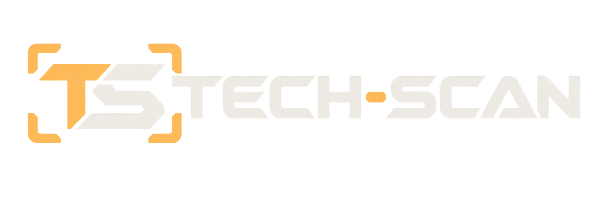
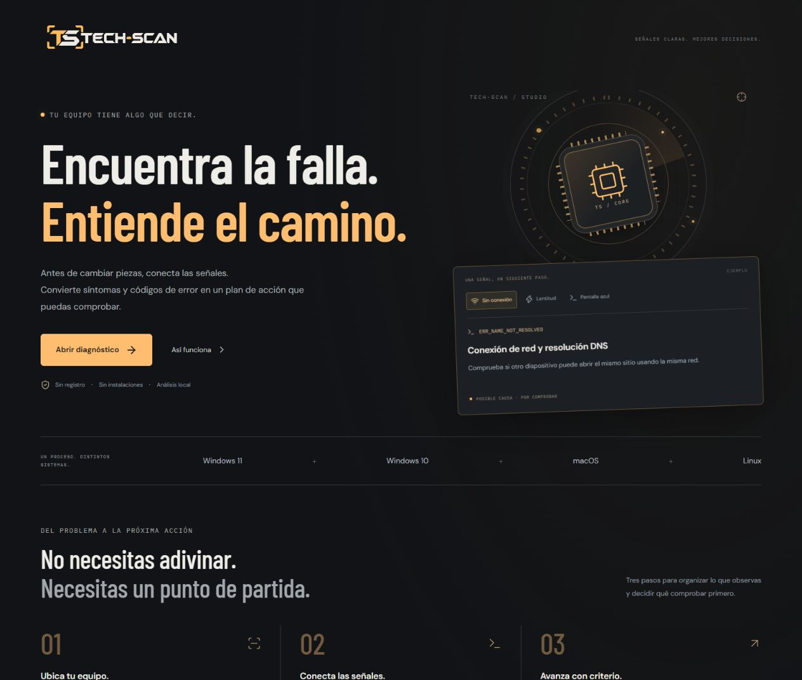
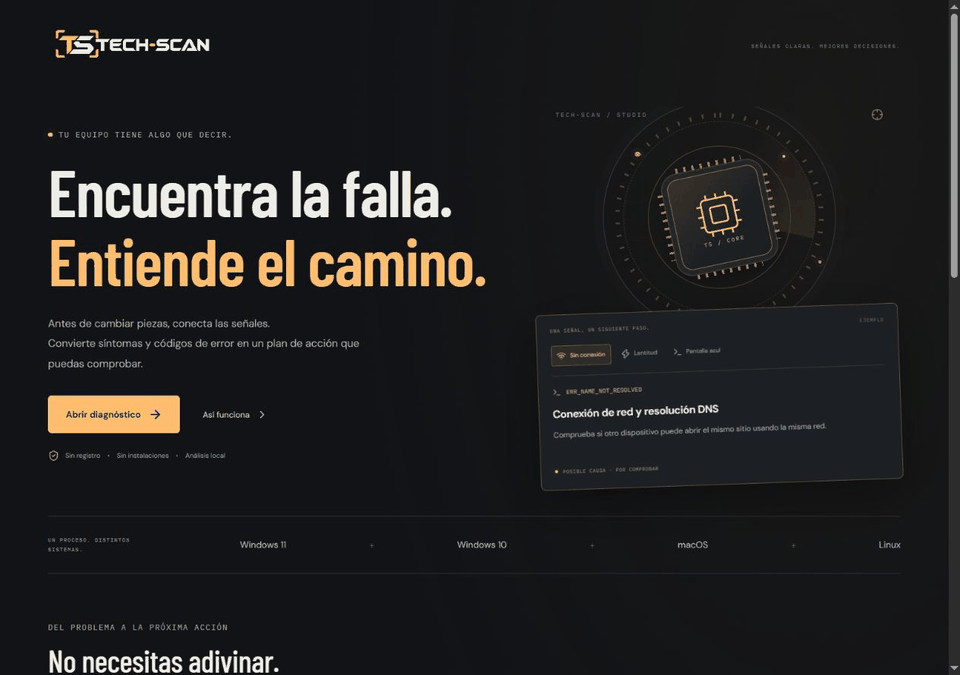
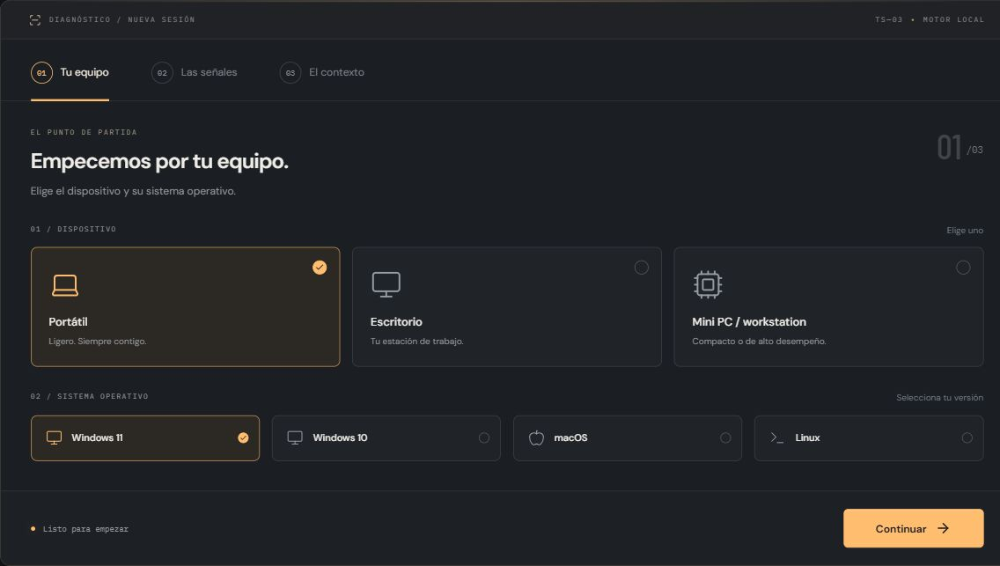
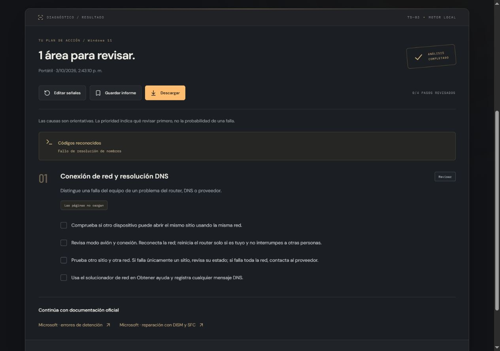
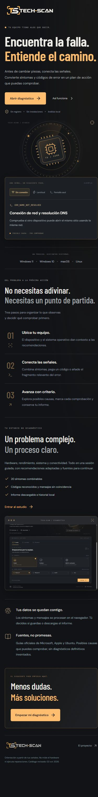
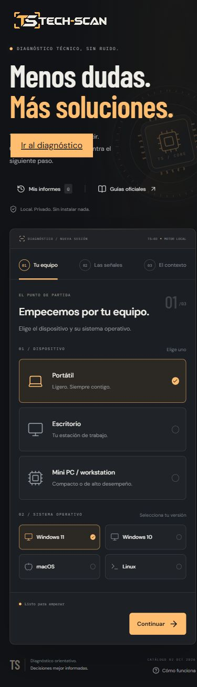

# Tech-Scan · Studio 03

<p align="center"></p>

Diagnóstico técnico en español: conecta síntomas y códigos de error con posibles causas, comprobaciones y documentación oficial. Una landing independiente presenta el sistema; el estudio guía el diagnóstico en tres pasos.

[Ver el sistema](https://analizajech.github.io/Tech-Scan/) · [Abrir diagnóstico](https://analizajech.github.io/Tech-Scan/#diagnostico) · [Identidad visual](docs/brand.md)



## Del síntoma al siguiente paso

1. **Tu equipo.** Selecciona el dispositivo y Windows 11, Windows 10, macOS o Linux.
2. **Las señales.** Combina 20 síntomas; filtra por categoría o busca sin perder selecciones.
3. **El contexto.** Añade un código o mensaje y obtén un plan ordenado por prioridad.

Marca comprobaciones, guarda hasta 20 informes en el navegador o descarga un informe de texto. Los mensajes desconocidos se identifican expresamente; no se inventan porcentajes de certeza.

### Recorrido real

El GIF muestra la landing, selección de señales, mensaje DNS, resultado y archivo de informes. Capturas tomadas de la aplicación en funcionamiento.



### Estudio y resultados





<details>
<summary>Ver interfaz móvil</summary>




</details>

## Diseño y tecnologías

Dirección visual grafito, ámbar y marfil; tipografía editorial, isologo integrado y gráfico de escaneo. La composición utiliza secciones y un flujo guiado, sin sidebar ni navbar. Los controles se construyen con React y primitivas accesibles de Radix UI.

| Tecnología              | Función                                                       |
| ----------------------- | ------------------------------------------------------------- |
| React 19 + TypeScript 7 | Componentes y lógica tipada                                   |
| Vite 8                  | Desarrollo y compilación                                      |
| Radix UI                | Diálogos con foco y controles de selección                    |
| Lucide React            | Iconos coherentes                                             |
| Fontsource              | Barlow Condensed, DM Sans e IBM Plex Mono alojadas localmente |
| node:test + tsx         | Pruebas del motor                                             |
| GitHub Actions + Pages  | Validación y publicación automática                           |

El diseño adapta el contenido a móvil, admite navegación por teclado y respeta la preferencia de movimiento reducido. Las licencias de las fuentes están en `public/licenses/`.

## Desarrollo

Requiere Node.js 22.12 o superior.

```sh
npm ci
npm run dev
npm test
npm run build
npm run preview
```

La entrada `/` presenta la landing; `/#diagnostico` abre el estudio. Las rutas con hash y los assets relativos permiten servir la aplicación en `/Tech-Scan/` sin configuración adicional de servidor.

| Archivo                             | Responsabilidad                                           |
| ----------------------------------- | --------------------------------------------------------- |
| `src/App.tsx`                       | Navegación entre portada y estudio                        |
| `src/Landing.tsx`                   | Presentación y ejemplos interactivos del motor            |
| `src/DiagnosticStudio.tsx`          | Sesión, flujo guiado e historial                          |
| `src/components/`                   | Controles, selector de síntomas, gráfico e informe        |
| `src/diagnostics.ts`                | Catálogo, reglas, reconocimiento de códigos y exportación |
| `src/storage.ts`                    | Validación y carga del historial local                    |
| `src/styles.css`, `src/landing.css` | Sistema visual y adaptación responsive                    |

## Alcance y privacidad

El análisis se realiza en el navegador sobre las señales que aportas. No accede a sensores, discos ni registros del sistema, no ejecuta reparaciones y no confirma componentes defectuosos. El gráfico de escaneo es una representación visual; no indica una lectura del hardware. No utiliza IA generativa, backend ni claves API.

Los síntomas y mensajes no se transmiten a servidores. Las fuentes tipográficas también se sirven desde el sitio. Guardar es una acción explícita: conserva equipo, sistema, señales, mensaje y resultado en localStorage. El historial puede eliminarse; no se cifra ni sincroniza. Las marcas de comprobaciones son temporales. Revisa el mensaje antes de compartir un informe.

Ante señales de riesgo eléctrico o batería, el motor prioriza detener el uso y suprime recomendaciones incompatibles con ese riesgo. Las indicaciones de sistema se adaptan al sistema operativo seleccionado.

## Catálogo y fuentes

Última revisión: **2 de octubre de 2026**. El catálogo es explícito y no se actualiza automáticamente. Para mantenerlo, modifica reglas, síntomas, códigos, enlaces y fecha en `src/diagnostics.ts`, y añade pruebas relevantes en `src/diagnostics.test.ts`.

- [Microsoft: errores de detención](https://support.microsoft.com/en-us/windows/resolving-blue-screen-errors-in-windows-60b01860-58f2-be66-7516-5c45a66ae3c6)
- [Microsoft: DISM y SFC](https://support.microsoft.com/en-au/windows/experience/backup-recovery/using-system-file-checker-in-windows)
- [Apple: Diagnóstico Apple](https://support.apple.com/en-ie/102550)
- [Apple: Primeros Auxilios](https://support.apple.com/en-gb/102611)
- [Ubuntu: problemas de red](https://help.ubuntu.com/stable/ubuntu-help/net-problem.html.en)
- [Ubuntu: diagnóstico básico](https://wiki.ubuntu.com/BasicTroubleshooting)

Las instrucciones de Ubuntu no se asumen universales para todas las distribuciones Linux. Las versiones de Windows que han terminado su soporte requieren considerar el soporte disponible antes de aplicar recomendaciones.

## Publicación y material visual

Cada push a `master` ejecuta las pruebas y la compilación antes de desplegar en GitHub Pages. En Settings → Pages, selecciona **GitHub Actions**. Los pull requests ejecutan validación.

El isologo, su proceso y los prompts están documentados en [docs/brand.md](docs/brand.md). Las capturas de esta versión están en `docs/media/`; `public/media/studio-preview.jpg` se utiliza también en la landing. El GIF se compone con Pillow a partir de capturas reales siguiendo [docs/media/README.md](docs/media/README.md).
